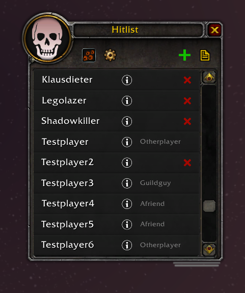
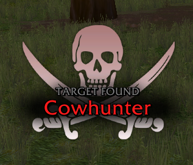
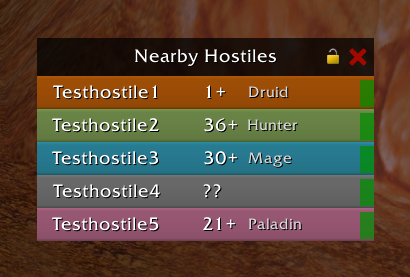

# Hitlist

A WoW Classic addon that lets you put names on a list and then notifies you whenever it finds them around you. You really don't like Playerxyz? You want to see him dead? Put him on the list and add a reason like "Maximum unskilled player that killed me!". Next time he is around you will know!

It can also sync that list with other people, either in guild or by using a custom chat channel. Additionally it can show you nearby hostile players, and tell you if someone stealthed.

## Features
* Keep a list of names and the reason for why you want them dead
* Notifies you when someone on the list is found
* Sync the list with other people
* Find nearby hostile players and show them in a list, guesses class and level based on spells used*
* Click to target from notification or nearby list
* Notify about stealth use, either for all or only for people on the list
* Can show the names of the last attacking players on death
* **/hl** for chat commands

## Images

Target notification and nearby hostiles list:

### Note
*Blizzard removed spell IDs from combat log as of the pre-launch event, so level prediction can't use ranks now, minimal possible level is shown.